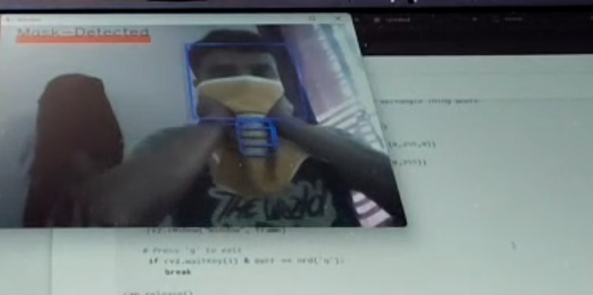
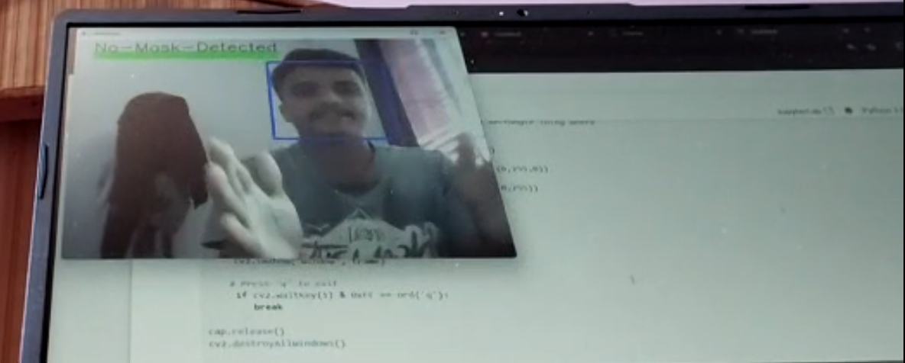

# 😷 Face Mask Detection Using OpenCV and Machine Learning

A simple and effective Face Mask Detection system built using **OpenCV**, **TensorFlow**, and **Keras**. The project detects whether a person is wearing a mask or not in real-time using a webcam feed or input images.

---

## 📌 Features

- Detects faces in real-time using Haar Cascades
- Classifies faces with or without masks using a CNN model
- Built using Python, TensorFlow, OpenCV, and Keras
- Trained on a custom dataset with augmentation

---

## 🖼️ Screenshots

### ✔️ Person With Mask  

### ❌ Person Without Mask  

---

## 📽️ Demo Video

> 🎬 Click below to watch a 20-second demo of the system in action:  
📌 **Important**: You can download and watch the file if it doesn't play directly.

▶️ [Watch Demo Video](demo.mp4.mp4)

---

## 🛠️ Technologies Used

- Python
- OpenCV
- TensorFlow / Keras
- NumPy
- Matplotlib
- Jupyter Notebook

---

## 📁 Folder Structure

